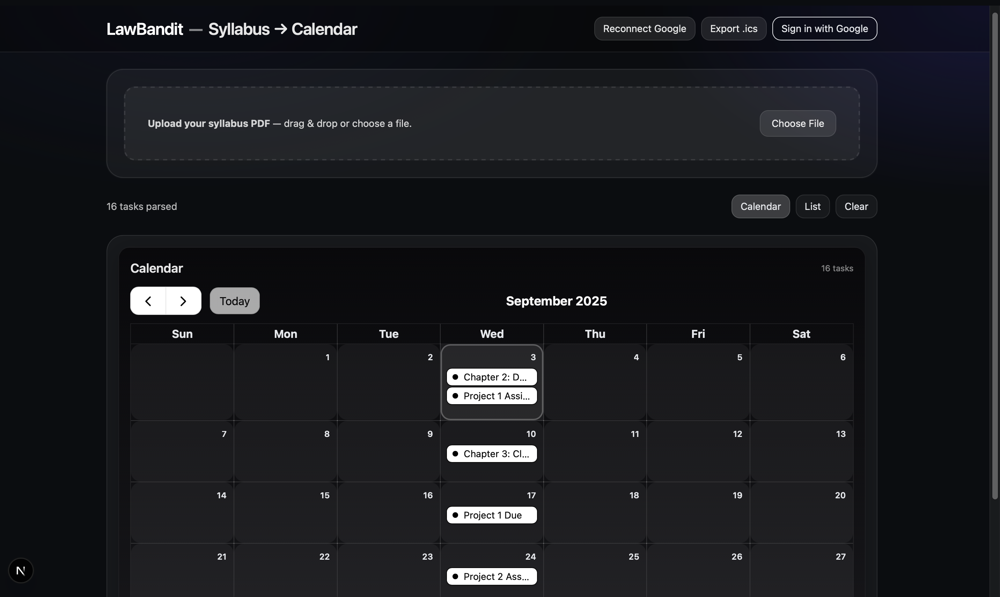

# LawBandit — Syllabus → Calendar

Turn class syllabus into a study calendar you can see on the web **and** in Google Calendar.  
Upload a PDF → we parse tasks (lectures, quizzes, exams) → view as **Calendar** or **List**, export **.ics**, or **sync** directly to your Google Calendar.

Plus an **Interpret** tool: select any topic title and get a quick, student-friendly explanation (Simple / Analogy / Key points).

---

## Features

- **Syllabus → Tasks**

  - Upload a syllabus PDF.
  - Extract tasks/dates (LLM-assisted) into a normalized `SyllabusTask` list with de‑duplication.

- **Views**
  - **Calendar** (FullCalendar) and **List** views.
- **Exports**

  - **.ics** download for offline calendar apps.

- **Google Calendar Sync**

  - Sign in with Google (NextAuth).
  - Ipsert events into the user’s Google Calendar, with proper all‑day vs timed handling.
  - “Open Google Calendar” shortcut after sync and a **Reconnect Google** button.

- **Interpret (Highlight → Explain)**
  - Select any topic text in **List** view → small **Explain** bubble.
  - Popover with tabs: **Simple**, **Analogy**, **Key points**; copy & regenerate; ESC to close.
  - Uses OpenAI server‑side endpoint.

---

## Tech Stack

- **Next.js 15 (App Router)** + **TypeScript**
- **Node.js runtime on Vercel Serverless Function**
- **NextAuth** (Google OAuth)
- **Google Calendar API** (`googleapis`)
- **OpenAI** (server route with fetch)
- **TailwindCSS**
- **Vercel** (deployment + env)
- **FullCalendar** (calendar UI)
- `pdf-parse` (PDF text extraction)
- `ics` (generate `.ics` files)

---

## Local Setup

1. **Install**

   ```bash
   npm i
   ```

2. **Environment variables** — create a `.env.local` at the repo root:

   ```bash
   # NextAuth
   NEXTAUTH_URL=http://localhost:3000
   NEXTAUTH_SECRET=your_long_random_string

   # Google OAuth (from Google Cloud Console)
   GOOGLE_CLIENT_ID=...
   GOOGLE_CLIENT_SECRET=...

   # OpenAI
   OPENAI_API_KEY=sk-...

   # Optional: tweak logging
   # DEBUG=next-auth:*
   ```

   - Generate `NEXTAUTH_SECRET` quickly:
     ```bash
     node -e "console.log(require('crypto').randomBytes(32).toString('hex'))"
     ```

3. **Run dev**
   ```bash
   npm run dev
   ```

---

## Google OAuth & Calendar API Setup

1. **Enable API**

   - Google Cloud Console → “APIs & Services” → “Enable APIs and Services” → enable **Google Calendar API**.

2. **OAuth consent screen**

   - Type: **External**.
   - App name, support email, and **Scopes**: add `.../auth/calendar.events` (plus default profile/email/openid).
   - Add your email to **Test users** while in _Testing_ mode.

3. **Credentials → Create OAuth client ID**

   - Type: **Web application**.
   - **Authorized redirect URIs** (local & prod):
     - `http://localhost:3000/api/auth/callback/google`
     - `https://<your-vercel-domain>/api/auth/callback/google`

4. **Copy credentials** to `.env.local` / Vercel Project Settings → **Environment Variables**.

5. **Common login errors**
   - **redirect_uri_mismatch**: make sure the exact Vercel domain callback is in the client’s Authorized redirect URIs.
   - **403 insufficient permissions**: revoke app access at https://myaccount.google.com/ → Security → Third‑party access, then sign in again (ensure `calendar.events` scope).

---

## Google Calendar Sync Details

- API route: `src/app/api/google/sync/route.ts`
- Each event uses a deterministic ID derived from `title|date|time` to avoid duplicates on re‑sync.
- **All‑day** events: end date is **exclusive** (we set `end = start + 1 day`).
- **Timed** events: default duration **1 hour** when no explicit end is present.
- On sync: we try **update** first, insert on **404** (idempotent upsert).

---

## Interpret (Explain) UX

- Component: `src/components/interpret/Interpret.tsx`
- How it works:
  1. Highlight a small phrase in **List** view → tiny **Explain** bubble appears above selection.
  2. Click **Explain** → popover opens with tabs:
     - **Simple**: student‑friendly definition.
     - **Analogy**: a concrete comparison.
     - **Key points**: 3–5 bullets.
  3. **Copy** or **Regenerate**; press **ESC** to close.
- Server route: `src/app/api/interpret/route.ts`
  - Sends `{ text, context }` to OpenAI and returns `{ simple, analogy, bullets[] }`.

> **Note:** The OpenAI SDK (v5) may require `--force` when installing if your project uses `zod@4`:
>
> ```bash
> npm i openai --force
> ```

---

## .ics Export

- API route: `src/app/api/ics/route.ts`
- Uses `ics` package via the helper `src/lib/icsExport.ts` to build an `.ics` file from `SyllabusTask[]` and streams it back as `text/calendar`.

---

## Deploy on Vercel

1. Push to GitHub and connect the repo in Vercel.
2. Add the same env vars in **Vercel → Project → Settings → Environment Variables**:
   - `NEXTAUTH_URL` (your Vercel URL, e.g., `https://calender-xxxx.vercel.app`)
   - `NEXTAUTH_SECRET`
   - `GOOGLE_CLIENT_ID`
   - `GOOGLE_CLIENT_SECRET`
   - `OPENAI_API_KEY`
3. Re‑deploy.
4. In Google Cloud Credentials, add your **production** callback URL:
   - `https://<your-vercel-domain>/api/auth/callback/google`
5. If you plan to open to the public, move OAuth consent **Publishing status** to _In production_ (after Google’s verification).

---

## Output

- Home Page
  

- Syllabus pdf uploaded
  

- Before syncing with google calendar
  

- During syncing with google calendar
  

- After syncing with google calendar
  

- List of all task
  

- Interpret Explain button
  

- Interpret Simple Defination
  

- Interpret Analogy
  

- Interpret keypoint
  
